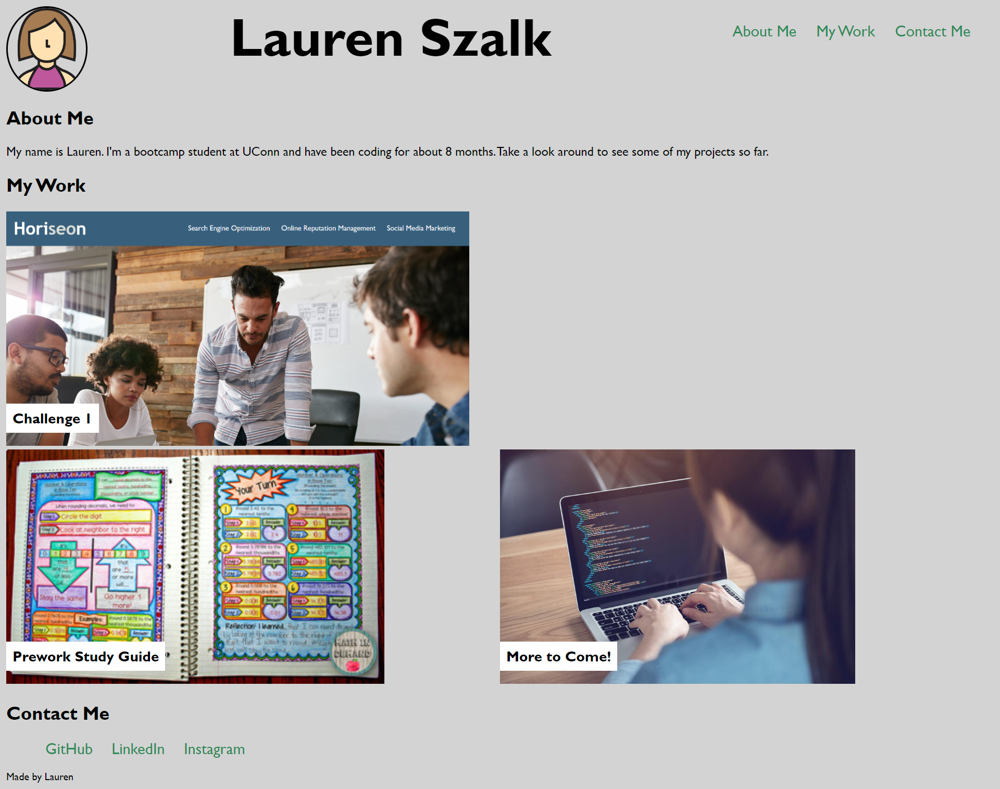

# Challenge2

Module 2 Challenge- Porfolio Website

## Description

The motivation for this website was to design a portfolio page of samples of my work so that potential employers can assess my skills and talents and consider me for open positions. This website will be updated regularly as I build my portfolio.

## Installation

N/A

## Usage

Employers will be able to see my name, my work, and my contact information. When they are viewing samples of my work they will be able to click on the images to follow the links to the deployed applications. THe website is also responsive.

## Credits

N/A

## License

Please refer to the LICENSE in the repo.

## Other Info

https://github.com/laurszalk/challenge2
https://laurszalk.github.io/challenge2

